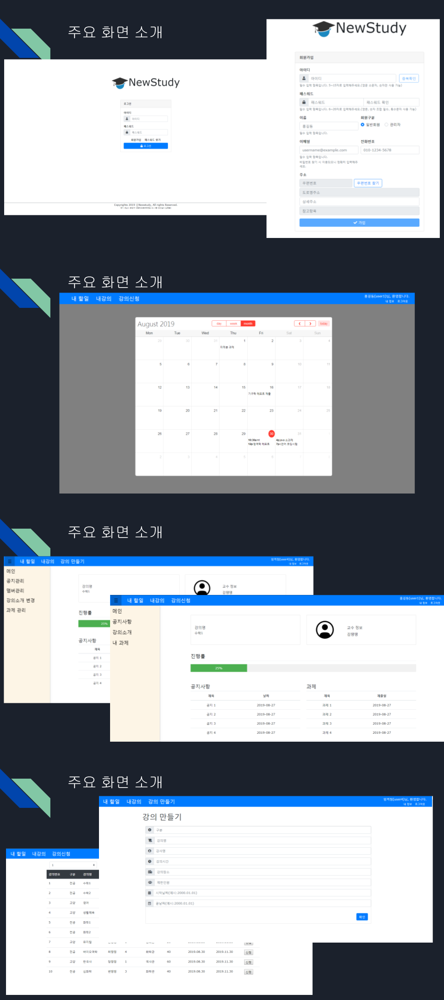
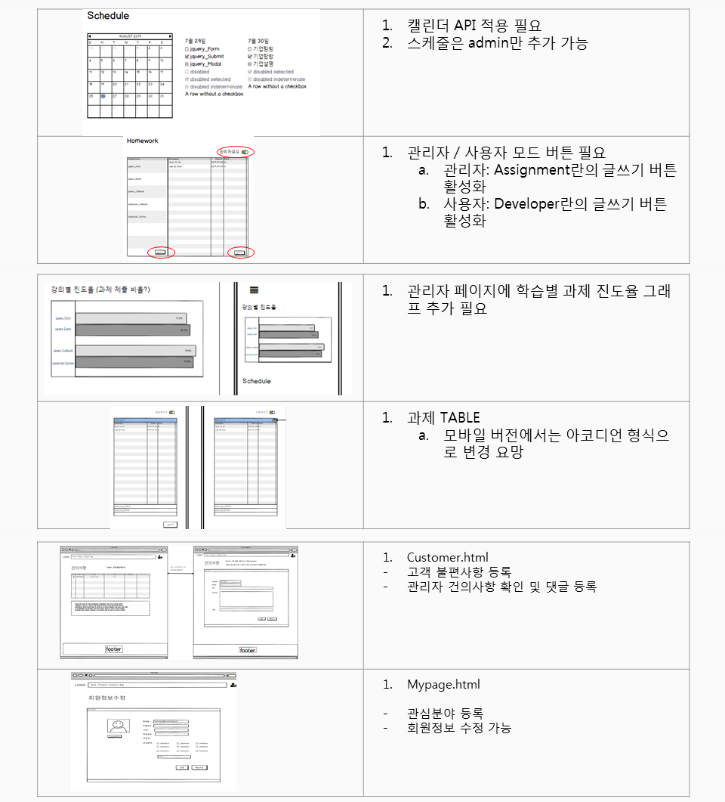

# final_project

## 소개
경기도경제과학진흥원에서 주관한 청년IT인재육성 프로그램(Front-end Developer 과정)에서 최종 프로젝트로 진행한 결과물입니다.
* 교육기간: 2019.07.08. ~ 2019.08.30. (총 270시간)
* 참고사항: [보도자료](http://www.digitaltoday.co.kr/news/articleView.html?idxno=211572)
## 참여자 목록
### 기획자
* 송소영 ([SoyeongSong](https://github.com/SoyeongSong))
* 현유진 ([HyunYujin](https://github.com/HyunYuJin/))
* 이제찬 ([jeky22](https://github.com/jeky22/))
* 강인식 ([inchic](https://github.com/inchic/))
### 개발자
* 김민우 ([minwoo21](https://github.com/minwoo21))
* 변재웅 ([JaewoongByeon](https://github.com/JaewoongByeon/))
* 최중진 ([choijungjin1](https://github.com/choijungjin1))
* 백성훈 ([sg03142](https://github.com/sg03142))

## 주요 화면

## 기획자 요청 사항

